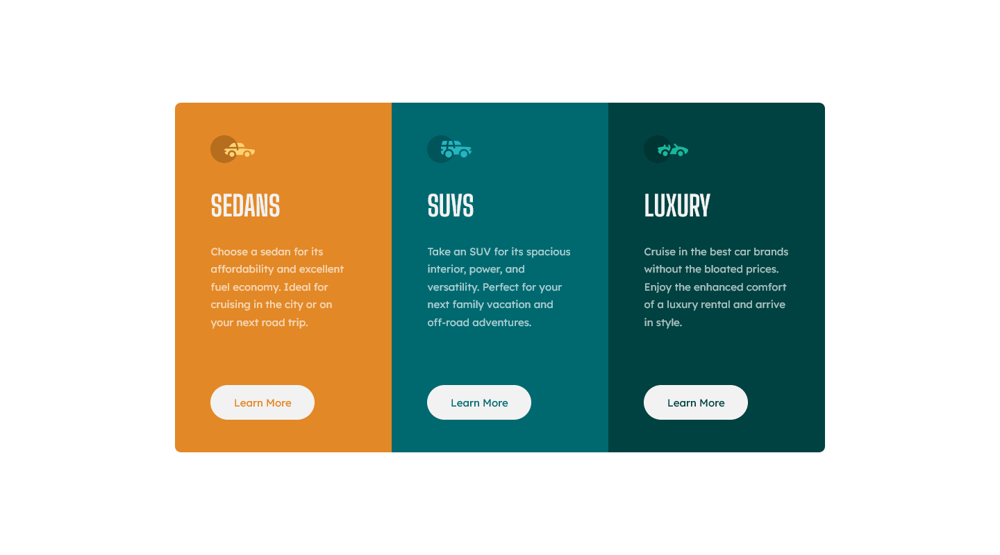
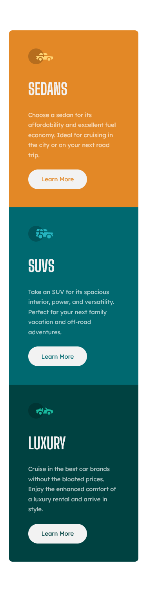

# Frontend Mentor - 3-column preview card component solution

This is a solution to the [3-column preview card component challenge on Frontend Mentor](https://www.frontendmentor.io/challenges/3column-preview-card-component-pH92eAR2-). Frontend Mentor challenges help you improve your coding skills by building realistic projects.

## Table of contents

- [Overview](#overview)
  - [The challenge](#the-challenge)
  - [Screenshot](#screenshot)
  - [Links](#links)
- [My process](#my-process)
  - [Built with](#built-with)
  - [What I learned](#what-i-learned)
- [Author](#author)

## About myself

I'm an aspiring front-end developper which means this project is not the best learning material yet i always try to explain part of my process to the best of my abilities. Which brings me to my second point, english isn't my first language so please excuse me for any mispellings or grammatical errors, past or future.

## Overview

### The challenge

Users should be able to:

- View the optimal layout depending on their device's screen size
- See hover states for interactive elements

### Screenshot

### Links

- Solution URL: [Project on GitHub](https://github.com/joanFaseDev/3-column-preview-card)
- Live Site URL: [Project hosted through Vercel](https://3-column-preview-card-mu.vercel.app/)

## My process

### Analysis

- The card have two different layouts, one for mobile and the other for desktop computer. That means the card is responsive.
- In mobile design, the card is made out of three rows. In desktop design, it is made out of three columns. This pattern is easy to reproduce by using CSS Grid.
- The card can be divided into three parts (Sedans, Suvs and Luxury). Their content is different but their layout is the same. That means we can resuse a lot of css code by using class effectively.
- For each part, we can use a _section_ element. Nested in it, a _img_ for the svg icon, a _h2_ for the title, a _p_ for the description and an _a_ for the button.
- We can probably add a _div_ container between the _section_ and the other elements. By setting a width in percentage, we won't have to rely too much on padding which isn't too great for responsiveness.
- The padding inside each part doesn't seem to change too much between mobile layout and desktop layout, except for the space between the paragraph and the button which is bigger in desktop design.
- The buttons have an hover state where background-color and color switch. Can be reproduced with _transition_ and pseudo-class _:hover_.

### Built with

- Semantic HTML5 markup
- CSS custom properties
- Flexbox
- CSS Grid

### What I learned

- The importance of using naming convention in CSS and how spare containers and appropriate classes can make a project easier to manage by resuing bits of code.
- That designing for mobile first feels way more natural, media queries are then used to add complexity to the design instead of removing it.

## Author

- Frontend Mentor - [@joanFaseDev](https://www.frontendmentor.io/profile/joanFaseDev)
